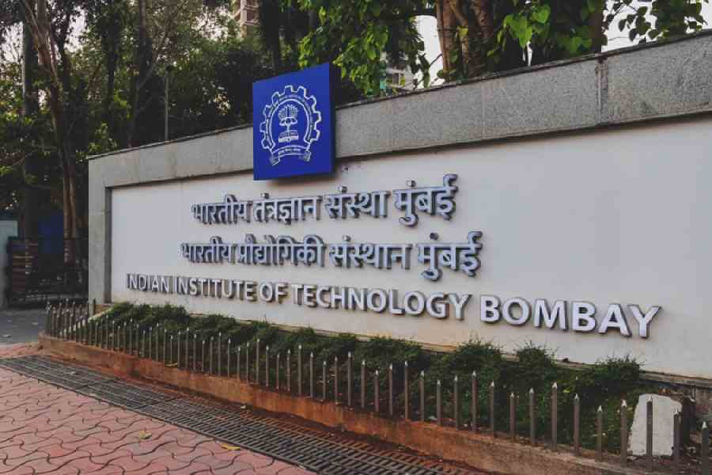

# [INDIAN INSTITUTE OF TECHNOLOGY, BOMBAY, INDIA](https://www.iitb.ac.in/)

## Project Overview

Here you can write a detailed description of your project. Explain what it is, how it works, and what technologies were used.

## Features

- **Feature 1**: Description of feature 1
- **Feature 2**: Description of feature 2

## Demo

You can embed videos or other media here:

<!--  -->

## Code

If you have code repositories, you can link to them here:

<!-- - [GitHub Repository](https://github.com/yourusername/your-repo) -->

## Additional Information

Any other details or information related to the project can be included here.

_yay_

[back to main page](./)
